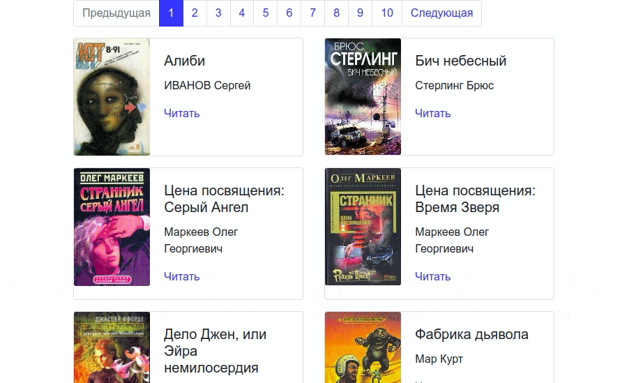

# Book library
## A parser that allows you to download books from https://tululu.org/


## **What you need**
* Python >= 3.10
* [Poetry](https://python-poetry.org/docs/)

## **How to install**
```
poetry install
```

## **How to run**
```
poetry run python3 src/parse_tululu [-h] [options]
```

* `--start_page` - Page number of the site from which the download begins. This value must be greater than 0 and less or equal than the number of the final page. `Default = 1`
* `--end_page` - Page number of the site where the download ends. This value must be greater or equal than the start page number. `Default = last page in the category`
* `--skip_imgs` - don't download the book covers
* `--skip_txt` - don't download the books
* `--dest_folder` - the path to the directory with parsing results: covers, books, JSON.
* `--json_path` - the path to the file with information about books


## **How to build a website**


## :link: **[Demo](https://alexsmkh.github.io/book_library/)**

* Parse data from tululu
* Run command: `poetry run python3 src/render_website.py`. This command will create html files based on the scraped data.
* Deploy your website to [GithubPages](https://docs.github.com/en/pages/quickstart). Open in your repository `Settings` > `Pages` > Select `branch` to `main`, `root` to `/` and save.